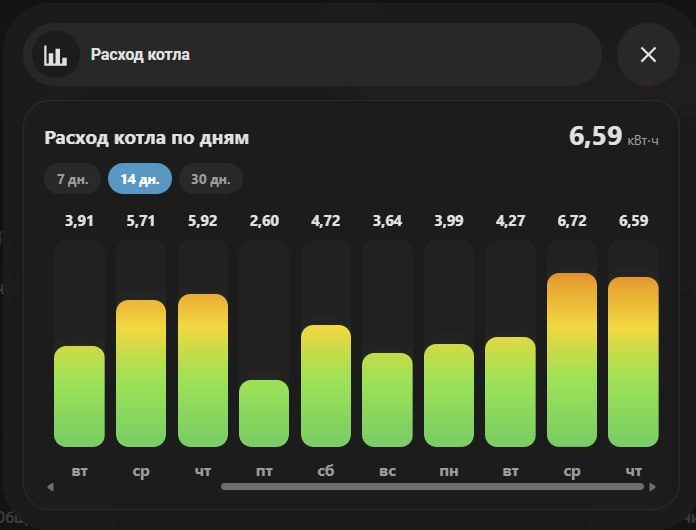

# Daily Energy Gradient Card

A custom Home Assistant Lovelace card that displays daily energy consumption as vertical bars on a fixed green → yellow → red scale.



## Features

- Daily energy values calculated from Home Assistant long-term statistics (`sum`), like the Energy dashboard.
- Fixed gradient scale: low values stay green; higher values reveal yellow, orange, and red.
- Selectable ranges such as 7, 14, and 30 days.
- Horizontal scrolling with automatic positioning on the latest day.
- Fast reopening with stale-while-revalidate browser caching.
- Live refresh in the background on every card load.
- Works inside regular dashboards and Bubble Card pop-ups.

## Important

Use a continuous cumulative energy sensor, normally one with:

- `device_class: energy`
- `state_class: total_increasing`
- a unit such as `kWh`

Do not use a monthly `utility_meter` as the source when the original cumulative sensor is available.

## Test installation with HACS

This card is not yet included in the default HACS catalog. Install it for testing as a custom repository.

[](https://my.home-assistant.io/redirect/hacs_repository/?owner=rbalaev&repository=daily-energy-gradient-card&category=plugin)

Or add it manually:

1. Open **HACS** and go to **Dashboard**.
2. Open the top-right menu and choose **Custom repositories**.
3. Enter `https://github.com/rbalaev/daily-energy-gradient-card`.
4. Select **Dashboard** as the category and click **Add**.
5. Find **Daily Energy Gradient Card** in HACS and click **Download**.
6. Refresh Home Assistant. HACS should register the frontend resource automatically.

The installed resource URL is normally:

```text
/hacsfiles/daily-energy-gradient-card/daily-energy-gradient-card.js
```

## Manual installation

1. Copy `daily-energy-gradient-card.js` to `/config/www/`.
2. Add a JavaScript module resource:

   ```text
   /local/daily-energy-gradient-card.js
   ```

3. Refresh the browser cache.

## Example

```yaml
type: custom:daily-energy-gradient-card
entity: sensor.boiler_energy
name: Boiler consumption by day
days: 7
day_options:
  - 7
  - 14
  - 30
max: 8
unit: kWh
decimals: 2
height: 240
```

## Bubble Card pop-up example

```yaml
type: custom:bubble-card
card_type: pop-up
hash: "#boiler-energy"
popup_mode: centered
width_desktop: 620px
full_width_on_mobile: true
name: Boiler consumption
icon: mdi:chart-bar
cards:
  - type: custom:daily-energy-gradient-card
    entity: sensor.boiler_energy
    name: Boiler consumption by day
    days: 7
    day_options:
      - 7
      - 14
      - 30
    max: 8
    unit: kWh
    decimals: 2
    height: 240
```

Open it from another card with:

```yaml
tap_action:
  action: navigate
  navigation_path: "#boiler-energy"
```

## Configuration

| Option | Required | Default | Description |
| --- | --- | --- | --- |
| `entity` | Yes | — | Continuous cumulative energy sensor. |
| `name` | No | `Расход по дням` | Card title. |
| `days` | No | `7` | Initially selected range. |
| `day_options` | No | `[7, 14, 30]` | Selectable ranges. |
| `max` | No | `8` | Top of the fixed color scale. |
| `unit` | No | `кВт⋅ч` | Displayed unit. |
| `decimals` | No | `2` | Decimal places. |
| `height` | No | `190` | Chart height in pixels. |

## License

MIT
